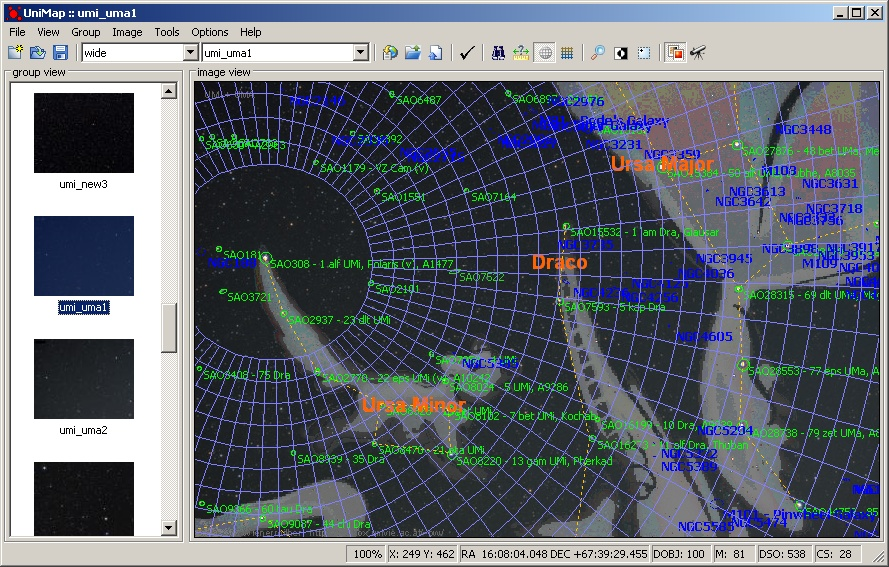
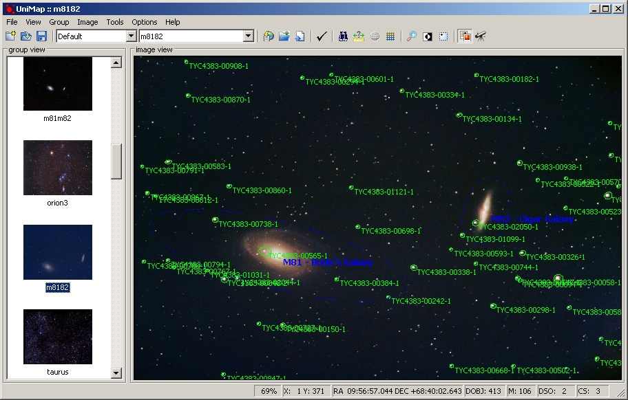
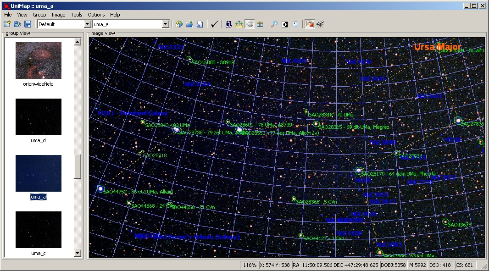
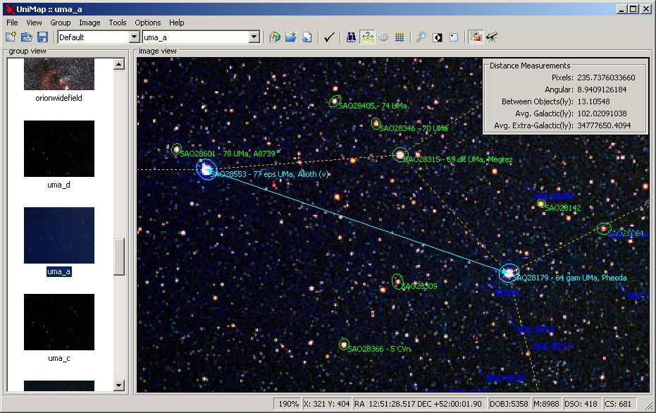
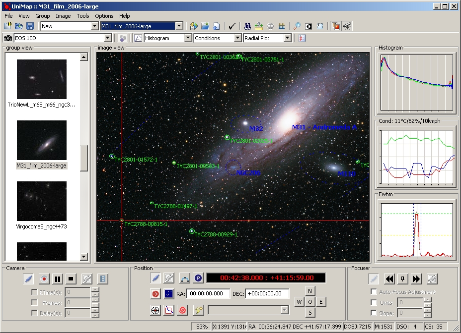
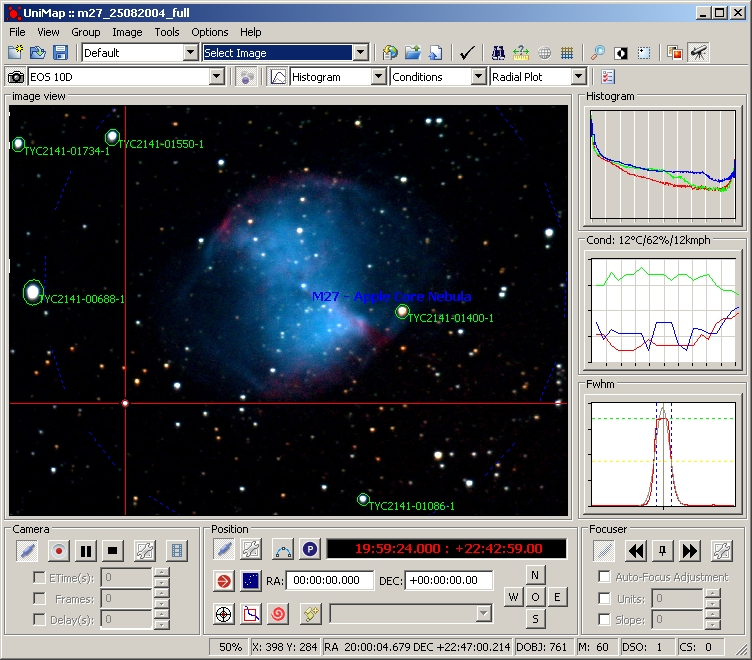
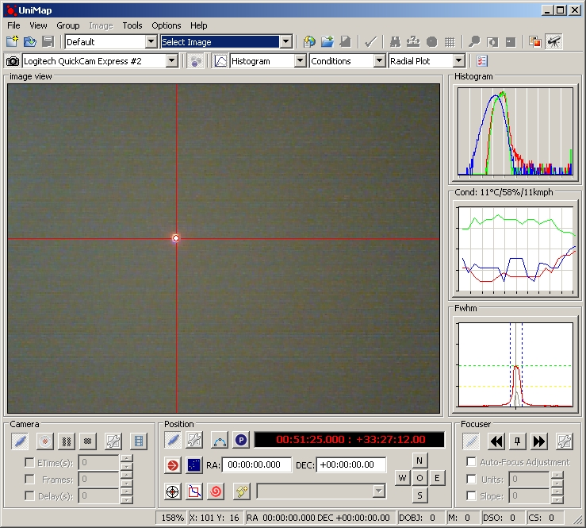
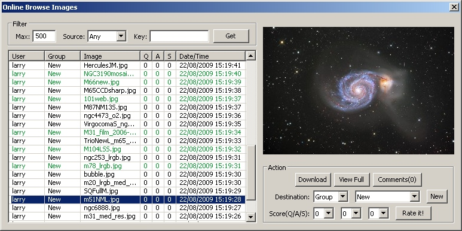
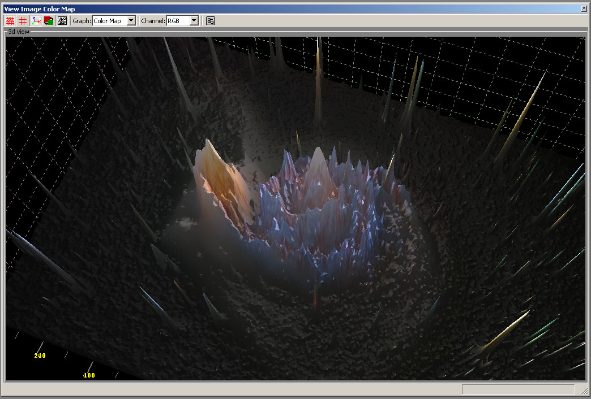
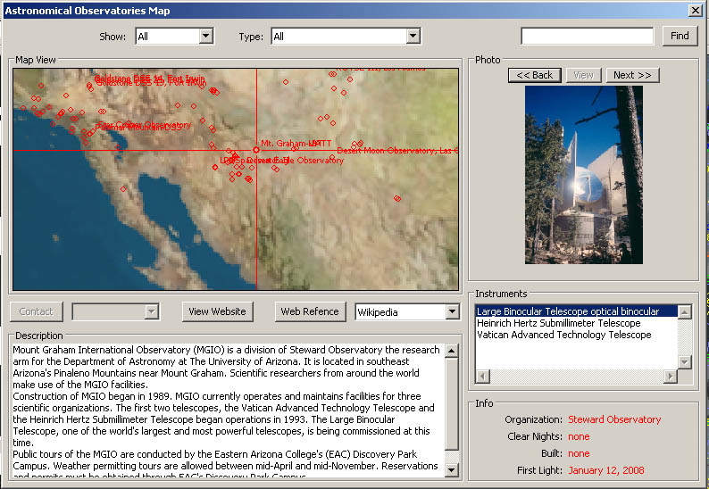

<h1>uniMap </h1>
<h3>(version 0.0.1.pre-alpha.4)</h3>

  

&nbsp;&nbsp;&nbsp;<b>UniMap</b> is a free/opensource application which I mainly developed to do the plate-solving (automated detection and sky catalog matching) for astrophotography -
<a href="find_star.html">see how detection works</a>. Additionally, I implemented a wide range of features like plotting the asteroids path, artificial Earth satellites
passing through, integrated telescope and digital/video camera control, online database/interface to work as a colaboration tool for plate solutions -
<a href="unimap_features.html">check the project features so far</a>.

  

&nbsp;&nbsp;&nbsp;The application  is written in C++/<a href="http://www.wxwidgets.org">wxWidgets</a> (cross platform GUI library),
OpenGL, <a href="http://sourceforge.net/projects/opencvlibrary">OpenCV</a>, Boost and other portable libraries so that it can be compiled/released on other platforms such as Linux/MacOSX/etc. Current pre-alpha release is only for windows, to follow with a Linux and MacOSx release as soon as I pass the beta test.
  
&nbsp;&nbsp;&nbsp;The project is to be released as a pre-alpha (concept proof) state and in order to test the the main functionality. Anyone interested in helping me to test and optimize it please <a href="http://larryo.org/contact.html">contact me</a>.
  
&nbsp;&nbsp;&nbsp;Also, I am working to add translation in twenty different languages to start with, so if you are willing to help on this please let me know.
  
&nbsp;&nbsp;&nbsp;I am looking for sponsorship to support this free software.
That will go to host this project on it’s own site (capable to handle a large world wide collaboration database) and also to develop a wide spectrum of aditional features.
For further details on how you can help please <a href="mailto:unimap@larryo.org?subject=re: Sponsorship">contact me</a>.

  

<i>UniMap - main screen - integrated telescope/camera control</i>
  

<h2><b>MORE SCREENSHOTS</b></h2> 

 <i>Ursa Minor detection with grid and constellation artwork</i> 

 

 <i>M81/M82 - Bode's galaxy and Cigar galaxy plate-solving</i> 

 

 <i>Ursa Major detection with grid and constellation lines</i> 

 

 <i>Star/Object details screen - Spectrum Tab</i> 

 <i>Star/Object details screen - NASA skyview/DSS image and References tab</i> 

 <i>Astronomical distances measurement tool - Alioth to Phecda in Ursa Major</i> 

 <i>Integrated telescope and camera control overview - M31 - Adromeda galaxy 

  

 
<i>Integrated telescope and camera control - tracking a star in M27 with digital camera. 

 <i>Integrated telescope and camera control - tracking a laser pointer on the wall with a webcam. 

 <i>Unimap online image browse/download/rate</i> 

 <i>3d Image Color Plot - OpenGL</i> 

 <i>3d Image Color Plot with Photo map</i> 

 <i>3d Image Color Plot</i> 

 <i>World Wide Observatories Interactive map</i> 

 <i>Current weather satellite view</i> 

 <i>Interactive world wide Light Pollution map</i> 

 <i>Weather Forecast Screen</i> 

 <i>Seeing prediction - 48h - for North America with ClearSky</i> 

 <i>Seeing prediction - 7 days - for Europe with Meteo Blue</i> 

 <i>Catalog  Selection - Stars Tab</i> 

 Catalog  Selection - Earth Artificial Satellites Tab</i> 

 Sample Filter Screen</i> 

 Sun View - Latest solar activity</i> 

